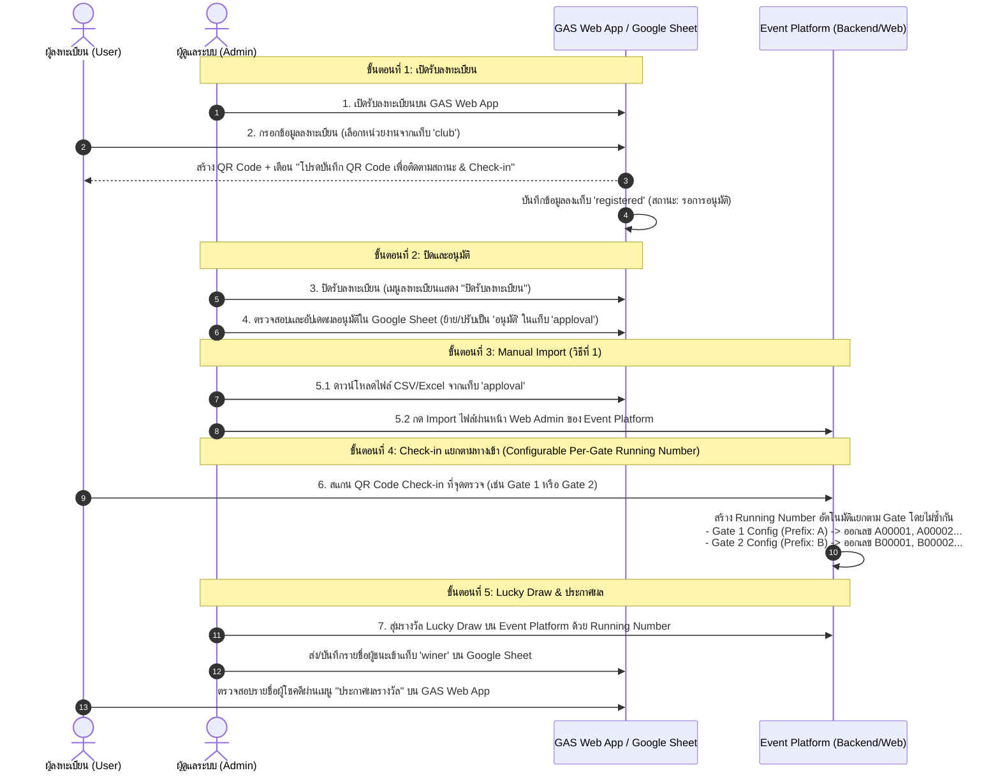

# แผนการดำเนินงาน (อัปเดต): ระบบลงทะเบียนผ่าน GAS และการเชื่อมต่อ Event Platform

เอกสารนี้ได้รับการอัปเดตตามข้อกำหนดใหม่ โดยระบุรายละเอียดการกำหนดรูปแบบ Running Number แยกตามทางเข้า (Check-in Gate) และการใช้กระบวนการ Manual Import ไฟล์ CSV/Excel จาก Google Sheet

---

## 📌 ภาพรวมสถาปัตยกรรมและกระบวนการทำงาน (Updated Workflow)



---

## 🎯 สรุปการอัปเดตข้อกำหนดสำคัญ (Key Updates)

### 1. ระบบ Running Number แยกตามจุด Check-in / Gate (Per-Gate Prefix Config)
- **โจทย์หลัก**: ในแต่ละจุดทางเข้า (Check-in Point / Gate) จะตั้งค่ารูปแบบ (Config)Prefix ของ Running Number แตกต่างกัน เพื่อใช้ออกเลขตั๋ว/จับรางวัล Lucky Draw โดย **ห้ามซ้ำกันข้าม Gate**
- **ตัวอย่างการตั้งค่า Prefix**:
  - **Gate 1 (ทางเข้าที่ 1)**: Prefix = `A`, ตัวเลข 5 หลัก (เช่น `A00001`, `A00002`, ..., `A99999`)
  - **Gate 2 (ทางเข้าที่ 2)**: Prefix = `B`, ตัวเลข 5 หลัก (เช่น `B00001`, `B00002`, ..., `B99999`)
  - **Gate 3 (ทางเข้า VIP)**: Prefix = `VIP`, ตัวเลข 4 หลัก (เช่น `VIP0001`, `VIP0002`, ...)
- **กลไกการออกเลข (Generation Logic)**: เมื่อผู้เข้าร่วมงานสแกน QR Code ที่ Gate ใด ระบบจะดึง Config ของ `CheckinPoint` นั้นๆ แล้วออกเลขลำดับถัดไปที่ยังไม่ถูกใช้งานของ Gate นั้นโดยอัตโนมัติ

### 2. วิธีการเชื่อมโยงข้อมูล (Data Integration - Method 1: Manual Import)
- **การนำเข้าข้อมูล (Import Process)**:
  1. Admin Export/ดาวน์โหลดไฟล์ CSV หรือ XLSX จากแท็บ `apploval` ใน Google Sheet
  2. Admin เข้าสู่ระบบ Event Platform Web Admin (`apps/web-admin`) ไปที่เมนู **"นำเข้าข้อมูลผู้ลงทะเบียน (Import Registrations)"**
  3. อัปโหลดไฟล์ CSV/XLSX เข้าสู่ระบบ ระบบจะสร้าง Record ผู้ลงทะเบียนพร้อมสถานะ `APPROVED` เพื่อเตรียมพร้อมสำหรับสแกน Check-in หน้างาน
  - *ข้อดี*: สะดวก ปลอดภัย ไม่ต้องเปิด Public API Endpoint เพื่อเชื่อมต่อข้ามระบบ

---

## 🛠️ รายการไฟล์และโค้ดที่จะต้องแก้ไข (Proposed Changes)

### 1. Database Model (`prisma/schema.prisma`)

#### [MODIFY] [schema.prisma](file:///d:/Project/event-platform/prisma/schema.prisma)
- เพิ่มฟิลด์ `prefix` และ `numberPadding` ใน `CheckinPoint` model สำหรับตั้งค่า Prefix แยกตามทางเข้า
- เพิ่มฟิลด์ `runningNumber` และ `checkinPointId` ใน `Registration` model

```prisma
model CheckinPoint {
  id             String    @id @default(cuid())
  eventId        String
  name           String    // เช่น "Gate 1 - ประตูทางเข้าหลัก"
  location       String?
  prefix         String    @default("A") // เช่น "A", "B", "VIP"
  numberPadding  Int       @default(5)   # จำนวนหลัก เช่น 5 -> 00001
  currentSeq     Int       @default(0)   # ลำดับล่าสุด
  isActive       Boolean   @default(true)
  sortOrder      Int       @default(0)
  createdAt      DateTime  @default(now())

  event          Event     @relation(fields: [eventId], references: [id], onDelete: Cascade)
  checkins       Checkin[]

  @@index([eventId])
  @@map("checkin_points")
}

model Registration {
  id             String             @id @default(cuid())
  eventId        String
  fullName       String
  email          String?
  phone          String?
  company        String?
  department     String?
  qrCode         String             @unique
  qrDataUrl      String?            @db.Text
  runningNumber  String?            @unique // Running Number ที่ออกตาม Gate (เช่น A00001, B00001)
  status         RegistrationStatus @default(REGISTERED)
  metadata       Json?              @default("{}")
  createdAt      DateTime           @default(now())
  updatedAt      DateTime           @updatedAt
  ...
}
```

---

### 2. Backend API Check-in (`apps/api/src/routes/checkins.ts`)

#### [MODIFY] [checkins.ts](file:///d:/Project/event-platform/apps/api/src/routes/checkins.ts)
- อัปเดตตรรกะการ Check-in เมื่อผู้ใช้สแกน QR Code ที่ Gate:
  1. ดึงข้อมูล `CheckinPoint` ที่ทำการสแกน
  2. คำนวณ Running Number ถัดไปตาม Prefix ของ Gate นั้น เช่น:
     `const seq = point.currentSeq + 1;`
     `const runningNumber = `${point.prefix}${String(seq).padStart(point.numberPadding, '0')}`;`
  3. บันทึก `runningNumber` ลงใน `Registration` และอัปเดต `currentSeq` ของ Gate
  4. ส่งค่า `runningNumber` กลับไปแสดงบนหน้าจอ `web-checkin`

---

### 3. Frontend Web Apps (`apps/web-admin`, `apps/web-checkin`, `apps/web-luckydraw`)

#### [MODIFY] [web-admin](file:///d:/Project/event-platform/apps/web-admin)
- เพิ่มฟอร์มจัดการจุด Check-in (Checkin Point Manager): ให้ Admin สามารถแก้ไขชื่อ Gate และตั้งค่า Prefix / Number Padding สำหรับแต่ละ Gate ได้ (เช่น Gate 1 = `A`, Gate 2 = `B`)
- เมนู Import Excel/CSV ปรับปรุงให้รองรับโครงสร้างคอลัมน์จากแท็บ `apploval` ของ Google Sheet

#### [MODIFY] [web-checkin](file:///d:/Project/event-platform/apps/web-checkin)
- แสดงข้อความยืนยันการ Check-in พร้อมเน้น **Running Number** ของผู้เข้าร่วมงานแบบตัวใหญ่ชัดเจน (เช่น **หมายเลขเข้าร่วมงาน: A00025**)

#### [MODIFY] [web-luckydraw](file:///d:/Project/event-platform/apps/web-luckydraw)
- หน้าจอวงล้อ / วิดีโอจับรางวัล Lucky Draw ให้ดึงเฉพาะผู้ที่ `CHECKED_IN` แล้ว และแสดงผล Running Number (เช่น `A00025`, `B00012`) ควบคู่กับ ชื่อ-นามสกุล และ หน่วยงาน

---

### 4. Google Apps Script Component (`gas/`)

#### [NEW] [Code.gs](file:///d:/Project/event-platform/gas/Code.gs) & [Index.html](file:///d:/Project/event-platform/gas/Index.html)
- 4 แท็บใน Google Sheet (`registered`, `apploval`, `club`, `winer`)
- 3 เมนูใน GAS Web App:
  1. **ลงทะเบียน**: ดึงหน่วยงานจากแท็บ `club`, สร้าง QR Code, เตือนให้บันทึกภาพ, มีสวิตช์ปิด/เปิดลงทะเบียน
  2. **ติดตามสถานะ**: ค้นหาด้วยเบอร์โทร/อีเมล/QR Code แสดงสถานะ `รอการอนุมัติ`, `อนุมัติ`, `check in`
  3. **ประกาศผลรางวัล**: ดึงข้อมูลผู้ชนะจากแท็บ `winer` มาแสดงผล

---

## 🧪 แผนการทดสอบและการตรวจรับ (Verification Plan)

1. **ทดสอบตั้งค่า Prefix แต่ละ Gate**:
   - สร้าง Check-in Point: Gate 1 (Prefix `A`), Gate 2 (Prefix `B`)
2. **ทดสอบ Manual Import**:
   - กรอกข้อมูลใน GAS -> Admin ตรวจสอบใน Sheet ย้ายไปแท็บ `apploval` -> Export เป็น XLSX/CSV -> Import เข้า Event Platform Admin
3. **ทดสอบ Check-in แยก Gate**:
   - ผู้ใช้ A สแกนที่ Gate 1 -> ยืนยันว่าได้ Running Number `A00001`
   - ผู้ใช้ B สแกนที่ Gate 1 -> ยืนยันว่าได้ Running Number `A00002`
   - ผู้ใช้ C สแกนที่ Gate 2 -> ยืนยันว่าได้ Running Number `B00001`
   - ยืนยันว่าไม่มีการออกเลขซ้ำกันข้าม Gate
4. **ทดสอบ Lucky Draw**:
   - สุ่มจับรางวัลด้วย Running Number (เช่น `A00001`, `B00001`) บน `web-luckydraw`
   - ยืนยันว่ารายชื่อผู้โชคดีบันทึกเข้าแท็บ `winer` และแสดงผลบน GAS Web App เมนู 3
